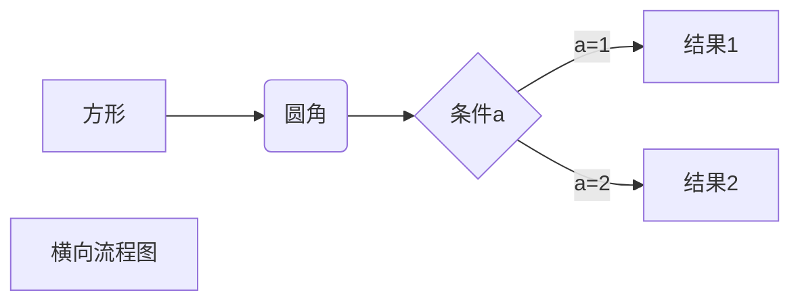
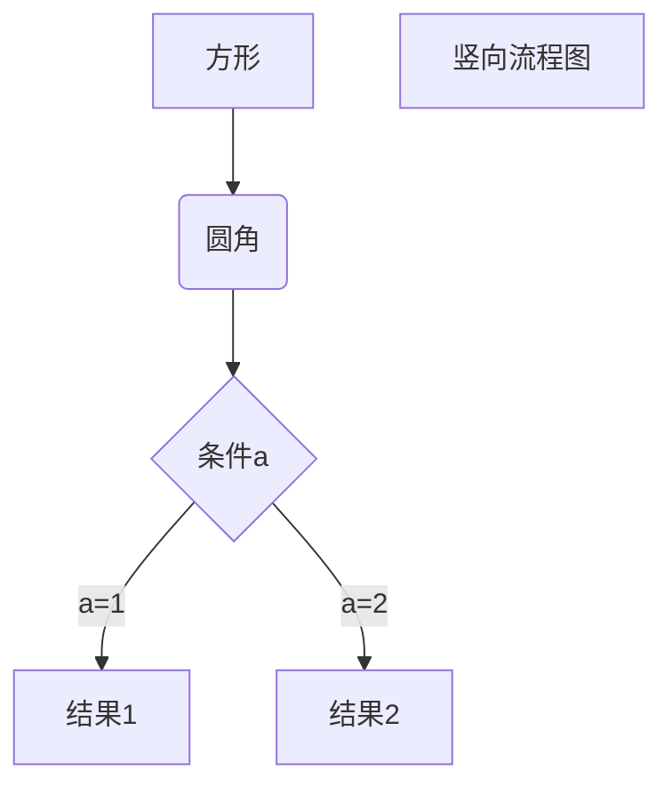

***
* * * 
*****
---
~~删除~~
<u>下划线</u>
---  
 1. 1
 2. 2
 3. 3
---
> 1
>> 2
>>> 3

* 第一项
>>>第一项
* 第二项
>>>第一项
* 第三项  
`print()` 函数

```javascript
$(document).ready(function () {
    alert('RUNOOB');
});
```
```javascript
$(document).ready(function(){
    alert('ok');
})
```
[baidu](http://baidu.com)  
[google][google]

这个链接用 1 作为网址变量 [Google][1]  
这个链接用 runoob 作为网址变量 [Runoob][runoob]  
然后在文档的结尾为变量赋值（网址）  

       


  [1]: http://www.google.com/
  [runoob]: http://www.runoob.com/
  [google]:http://www.google.com


  这个链接用 1 作为网址变量 [RUNOOB][img].
然后在文档的结尾为变量赋值（网址）

[img]: http://static.runoob.com/images/runoob-logo.png


|  表头   | 表头  |
|  ----  | ----  |
| 单元格  | 单元格 |
| 单元格  | 单元格 |

|姓名|年龄|性别|
|:----|----:|:----:|
|张三|27| 男|
|李四|35| 女|

使用 <kbd>Ctrl</kbd>+<kbd>Alt</kbd>+<kbd>Del</kbd> 重启电脑  
**文本加粗**   
\*\* 正常显示星号 \*\*<kbd> <b> <i> <em> <sup> <sub> <br>


<b>cuti</b>
<i>xieti</i>
<em>em</em><sup>2</sup><sub>3</sub>
$$
\begin{Bmatrix}
   a & b \\
   c & d
\end{Bmatrix}
$$
$$
\begin{CD}
   A @>a>> B \\
@VbVV @AAcA \\
   C @= D
\end{CD}
$$







```flow
st=>start: 开始框
op=>operation: 处理框
cond=>condition: 判断框(是或否?)
sub1=>subroutine: 子流程
io=>inputoutput: 输入输出框
e=>end: 结束框
st->op->cond
cond(yes)->io->e
cond(no)->sub1(right)->op
```

``` flow
st=>start: 开始框
op=>operation: 处理框
cond=>condition: 判断框(是或否?)
sub1=>subroutine: 子流程
io=>inputoutput: 输入输出框
e=>end: 结束框
st(right)->op(right)->cond
cond(yes)->io(bottom)->e
cond(no)->sub1(right)->op
```

``` sequence
对象A->对象B: 对象B你好吗?（请求）
Note right of 对象B: 对象B的描述
Note left of 对象A: 对象A的描述(提示)
对象B-->对象A: 我很好(响应)
对象A->对象B: 你真的好吗？
```