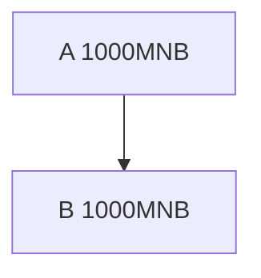
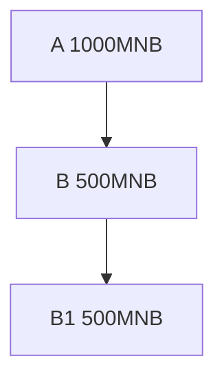
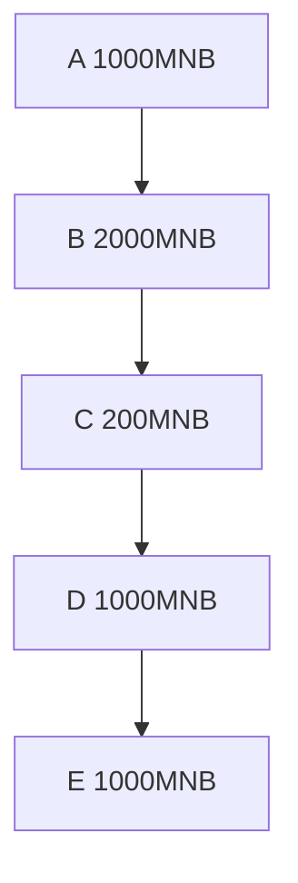

# MNB@BSC说明

## 背景
- MNB是MNT在BSC上的侧链，主要用于连接MNT产生更多的价值.  
- 区块链诞生已10年有余，在这10多年间的发展过程中，制造了太多的造富神话，让很多人对投资区块链蠢蠢欲动，然而投资是非常困难的，需要对技术，市场，金融，人性有充分的把握和理解. 从而让很多投资者产生了赌徒的心态, 让这个领域充满了骗局,太多的陷阱在等待投资者，然而投资者却总是抱有侥幸的心态在投资。
- 就其本质而言BTC并没有给世界带来任何的科技成果,只是给世界带来了一个新的金融游戏规则;各种保险,社保基金等何尝不是一个带有资金池的金融游戏呢? 他们的特点是没有贡献任何科技成功，只是让资金流转有个更加合理的规则，从而让大多数人收益. 任何金融产品，只要有资金池在，尽管没有创造任何实质的劳动成果，但却能让所有参与者收益，因为这不是与赌博一样的零和游戏.
- 什么样的区块链产品，更容易让投资者收益呢? 显而易见需要规则公平合理,资金安全,资金池大,有大量对规则认可的忠实粉丝, 才是值得投资的产品。基于上面的认知，MNT社区设计了如下项目:

|   事项    | MNB解决方法  | 保险公司解决方法 |
|  ----:    |  ----       | -----    |
| 项目规则   | 合约开源且不可修改 | 合同的形式发布 |
| 项目安全   | BSC成熟区块链环境 | 大公司背书 |
| 资金安全   | BSC成熟金融环境 | 大公司背书 |
| 资金池大小 | 流动性挖矿 | 合理的规则 |
| 社区大小   | 推广即挖矿 | 合理的规则 |
| 价值稳定性  | 投票加算力，投票锁定 | 对标法币 |

## 流动性挖矿
- 流动性挖矿采用MNB/USDT交易对,对该交易对贡献了多少资金来确定挖矿算力的大小.在享有uniswap挖矿收益的同时,还可以享有对MNB挖矿的收益.
uniswap挖矿的收益与交易金额总量的大小成正比,MNB挖矿的收益与时间的长短成正比.  
> - 示例:  
> 1. A对MNB/USDT开始流动性挖矿,提供了100个MNB金额.  
> 2. B同时也对MNB/USDT开始流动性挖矿,提供了200个MNB金额.  
> 3. 一天后B的收益是A的而2倍,假设这个时候A的收益为10MNB，B的收益则为20MNB.  
> 4. 假设A想达到与相等的收益,则需要继续增加110MNB的流动性,才能达到与B完全相等的收益.  
> 5. 如果在一天前他只需要多提供100MNB的流动性，就能达到与B相同的收益.这就是对MNB流动性挖矿最直观的解释.  
## 推广性挖矿
- A推广B的两种情况
> 正常推广

> 下级拆分

- ~~推广就是一棵不停向下蔓延的树,如果使用最简单的方法来做推广,不能保证推广者的收益.~~     
> - 示例1:
> 1. A推广了B，而B地址有1000个MNB.
> 2. A的推广值为1000,B的推广为0. 
> 3. B创建一个新账户B1，让B和B1建立推广关系，并把金额转到B1上.
> 4. A的推广值为0，B推广值1000，B1的推广值0，而A作为一个推广者，却没有任何收益.

- ~~如果把推广关系调整为上下级之间金额的最小值，且一个地址与上级也有关系，防止B把金额全部转走。~~  
> - 示例2：
> 1. 假设A推广了B，他们手中都有1000个MNB.  
> 2. A增加的推广值为1000，B的推广值也为1000.  
> 3. B创建一个新账户B1，并把1000个MNB转给B1，这样两个人的收益都是0，B显然不会这样做，如果把500的MNB转给B1，
> 4. A增加的推广值为500  
    B的推广值为500+500=1000  
    B1的推广值为500  
    B账户的全部推广值为1000+500=1500，创建B1账户后，让上级的推广减少了500，而自己增加了500，这个规则虽然比示例1好很多，但是依然对推广者有利益损失。

- _针对上面的推广难题,提出了非线性算法，每个账户的基本算力等于投票金额的**1.125次方**，自己的推广算力与下级的权重为**1**, 与上级的权重为**2**，自身的权重为**4**。_   
> - **计算方法**  
> **基本算力:** $\Huge pow(x) = x^{1.125} = x^{9/8} = x * \sqrt[8]{x}$      
> **实际算力:** $\Huge f(x) = 4 * pow(x) + 2 * \min(pow(x),pow(x_{up})) + \sum(\min(pow(x),pow(x_{down})))$  
> - 示例3： 
> 1. A推广了B，A和B地址中分别有1000个MNB.
> 2. A增加的算力为: $1000^{1.125} \approx 2371.37$
> 3. B地址算力为:   $2371.37 * 2 + 2371.37 * 4 = 14228.22$
> 4. B创建一个新账户B1，并给B1转了500MNB.
> 5. A地址增加的算力为: $500^{1.125} \approx 1087.28$
> 6. B地址算力为:      $1087.28 * 2 + 1087.28 * 4 + 1087.28 = 7610.96$
> 7. B1地址算力为:     $1087.28 * 2 + 1087.28 * 4 = 6523.68$
> 8. B账户的总算力为:   $7610.96 + 6523.68 = 14134.64$
> 9. B的拆分后的算力小于拆分前，对推广者A构成了损失，对自己也构成了损失，因此A没有这样做的动力.

### 地址等级制
通过上面的规则不难看出，投票越多对自己的算力越有力，针对不同的投票量，可以计算出资金放大系数，根据放大系数定义了地址等级
|   投票量       |   算力                      | 放大系数 | 等级 |
| ----:         |  ----                      | ----- | ----  |
| $1^8=1$       | $1^{1.125}=1$              | 1     | 青铜(0≤k<1) |
| $2^8=256$     | $256^{1.125}=512$          | 2     | 青铜(1≤k<2) |
| $3^8=6561$    | $6561^{1.125}=19683$       | 3     | 白银(2≤k<3) |
| $4^8=65536$   | $65536^{1.125}=262144$     | 4     | 黄金(3≤k<4) |
| $5^8=390625$  | $390625^{1.125}=1953125$   | 5     | 铂金(4≤k<5) |
| $6^8=1679616$ | $1679616^{1.125}=10077696$ | 6     | 钻石(5≤k<6) |
| 大于6**8       | 大于10077696               | 6     | 钻石(5≤k<6) |

从上面不难看出在非线性算法的作用下，投票越多对自己的算力越有利,但是大于1679616后这个优势消失.
### 算力挖矿收益分配
- 推广性挖矿每月为一个周期，与流动性挖矿不同，流动性挖矿没有周期，可以自由的进入和退出，系统为了鼓励社区更好的推广，每次挖矿的金额的80%归自己所有，20%用于奖励上级。  
示例:
> A推广B,B推广C,C推广D,D推广E.

假设E挖矿收益为100MNB，则80个MNB进入E的地址.  
总权重: $1000^{1.125} + 2000^{1.125} + 200^{1.125} + 1000^{1.125} \approx 10302.6$  
另外外20个MNB的分布如下:
|   地址 |    基本算力             | 权重比               |       收益  |
| ----: |  ----                  | -----               |     ----   |
| A     | $1000^{1.125} \approx 2371.37$ | $2371.37/10302.6=0.23$  |$20*0.23=4.6$|
| B     | $2000^{1.125} \approx 5172.00$ | $5172.00/10302.6=0.502$|$20*0.502=10.04$|
| C     | $200^{1.125} \approx 387.85$   | $387.85/10302.6=0.376$ |$20*0.0376=0.75$,**因为等级为青铜实际收益0**|
| D     | $1000^{1.125} \approx 2371.37$ | $2371.37/10302.6=0.23$  |$20*0.23=4.6$|

通过以上数据不难得出：无论是直接下级挖矿，还是间接下级挖矿，都会有收益，并且投票越多收益越大，拆分账户对自己更是带来损失。
想提高收益就只能多投票，多推广,如果想获得被动挖矿收益投票**不能低于256MNB**.

## MNB分布
- 创世100万MNB
- 流动性挖矿每分钟1MNB
- 算力推广性挖矿每分钟挖矿1MNB，
- 总和每分钟产生2个MNB, 挖矿20年为21035520MNB，与BTC的挖矿总产量相当.
## 在BSC上
- 项目风险低,技术风险低
- 金融环境好,有USDT,BNB等
- 手续费用低
- 安全的进场和离场
- 综上降低了投资者的风险
## 黑客攻击
- 标准的ERC20项目，如果助记词泄漏后，把自己的代币转出即可，有损失也是一次性的，而在本系统中，如果助记词泄漏后，因为做了很多推广，
带来的损失是长久的，因此系统通过上级提供了地址更换机制。  
> 示例: 
> 1. A推广了B，B也做了很多推广，
> 2. B不小心把助记词泄漏了，考虑到地址不在安全，B想换掉地址。
> 3. B生成新地址，并使用原来的钱包对新地址进行签名，把签名发给上级A。
> 4. A通过B发来的签名数据，把B的地址换成B提供的新地址。
> 5. 得到B助记词的黑客，因为和A没有关系，因此不能执行上面的操作。
## 挖矿风险
- 提供流动性时使用MNB系统，而在移除流动性时使用uniswap系统，将会导致挖矿风险，收益被其他人拿走.
- 正确的做法使用MNB提供流动性，使用MNB移除流动性，是利益最大化的做法.
## 发展思路
- lp挖矿保证金融属性.
- 算力挖矿保证社区扩张,两个规则相互依赖，缺少一个就会影响社区发展.
- 当前的环境，想得到信任非常困难，需要靠前期的资金来获得别人的信任.
- 操作界面上显示躺赢奖来激励别人，股东(军团长)躺赢奖的多少可以非常容易的看到他们做的好坏，每个周期地址增加的数量，推广数量，资金池深度，交易额，都是发展咱们发展好坏的指标. 
- 大量空投开发社区或者找BM108这样的项目，让他们看到池子的深度和交易量，并且连续几次的成功套现，建立信任关系后，才好让他们做到真正的投资.